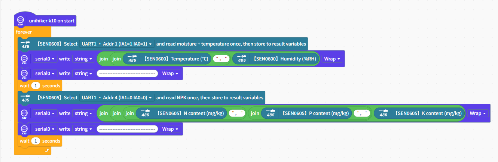
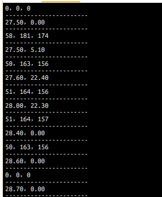
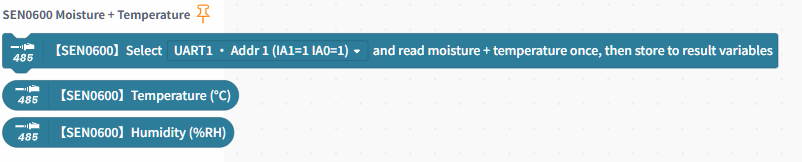
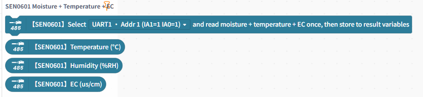
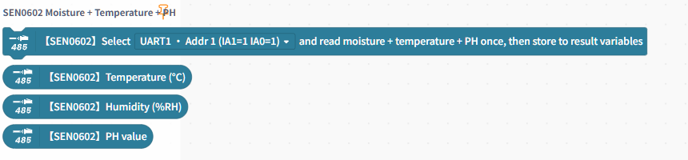
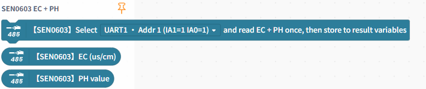
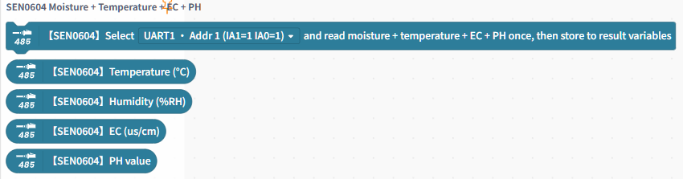
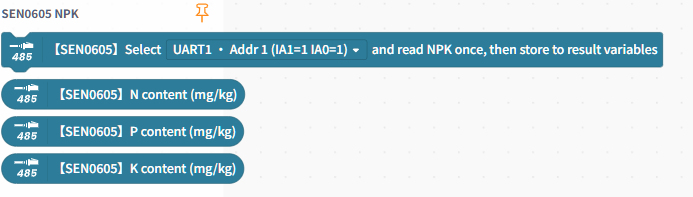

# RS485 Soil Sensors

[Upload] Mind+ upload mode extension for reading RS485 soil sensor data through the DFR0627 IIC-to-UART module.

## Extension Info

- Extension ID: `rs485soil`
- Version: `0.0.1`
- Author: `nick`
- Mode: `upload`
- Name (ZH): `RS485土壤传感器`
- Name (EN): `RS485 Soil Sensors`

## Changelog

| Version | Notes |
| --- | --- |
| 0.0.1 | Initial release with SEN0600~SEN0605 RS485 soil sensor support |

## Supported Devices

| Device ID | Support |
| --- | --- |
| `dev-DFRobot-arduinoUno` | ✅ |
| `dev-DFRobot-arduinoLeonardo` | ✅ |
| `dev-DFRobot-arduinoNano` | ✅ |
| `dev-DFRobot-arduinoMega2560` | ✅ |
| `dev-DFRobot-handpyEsp32` | ✅ |
| `dev-DFRobot-unihikerK10` | ✅ |

## Supported Sensor Models and Data Fields

This extension provides blocks for 6 sensor model groups:

- `SEN0600`: temperature, humidity
- `SEN0601`: temperature, humidity, EC
- `SEN0602`: temperature, humidity, pH
- `SEN0603`: EC, pH
- `SEN0604`: temperature, humidity, EC, pH
- `SEN0605`: nitrogen (N), phosphorus (P), potassium (K)

## Product Links

### Core Modules

- `DFR0627` (Gravity: I2C to Dual UART Module): [https://www.dfrobot.com/product-2001.html](https://www.dfrobot.com/product-2001.html)
- `DFR0845` (Gravity: Active Isolated RS485 to UART Signal Adapter Module): [https://www.dfrobot.com/product-2392.html](https://www.dfrobot.com/product-2392.html)

### Sensor Models

- `SEN0600` (Temperature + Moisture): [https://www.dfrobot.com/product-2816.html](https://www.dfrobot.com/product-2816.html)
- `SEN0601` (Temperature + Moisture + EC): [https://www.dfrobot.com/product-2817.html](https://www.dfrobot.com/product-2817.html)
- `SEN0602` (Temperature + Moisture + pH): [https://www.dfrobot.com/product-2818.html](https://www.dfrobot.com/product-2818.html)
- `SEN0603` (EC + pH): [https://www.dfrobot.com/product-2829.html](https://www.dfrobot.com/product-2829.html)
- `SEN0604` (Temperature + Moisture + EC + pH): [https://www.dfrobot.com/product-2830.html](https://www.dfrobot.com/product-2830.html)
- `SEN0605` (NPK): [https://www.dfrobot.com/product-2819.html](https://www.dfrobot.com/product-2819.html)

## Channel and Address Selection

The channel/address menu uses the format `channel_IA1IA0` (for example, `1_11`):

- `1_11`: UART1, address 1 (IA1=1, IA0=1)
- `1_01`: UART1, address 2 (IA1=0, IA0=1)
- `1_10`: UART1, address 3 (IA1=1, IA0=0)
- `1_00`: UART1, address 4 (IA1=0, IA0=0)
- `2_11`: UART2, address 1 (IA1=1, IA0=1)
- `2_01`: UART2, address 2 (IA1=0, IA0=1)
- `2_10`: UART2, address 3 (IA1=1, IA0=0)
- `2_00`: UART2, address 4 (IA1=0, IA0=0)

> Default baud rate is `9600` (matching common factory Modbus settings for DFRobot RS485 soil sensors).

## Block Usage Pattern

Each model group typically contains two kinds of blocks:

1. **"Read once and store to result variables"** (command block)  
   Triggers one serial read and refreshes internal cached values.
2. **Data reporter blocks** (temperature, humidity, EC, pH, N/P/K)  
   Reads values updated by the previous command block.

Recommended flow:

1. Place the model-specific "read once" command block first.
2. Read values using reporter blocks from the same model group.
3. Put this sequence inside a loop for periodic sampling.

## Dependencies

The generated Arduino code includes these libraries:

- `Wire.h`
- `DFRobot_IICSerial.h`
- `RS485Protocol.h`
- `RS485SoilSensor.h`

## Screenshots and Examples

### Example Program

### Serial Wiring

### Block Groups by Sensor Model

## FAQ

### 1) Why are readings always 0 or unchanged?

- Check sensor power, GND, and RS485 A/B wiring.
- Check DIP address bits (IA1/IA0) and ensure they match the selected menu address.
- Check that you are using the correct model block group (for example, do not mix SEN0601 and SEN0604 blocks).

### 2) How do I connect multiple sensors?

Use different UART/address combinations (such as `1_11`, `1_01`, `2_11`) to distinguish sensors.  
Call each sensor's corresponding "read once" block, then read its data reporters.

